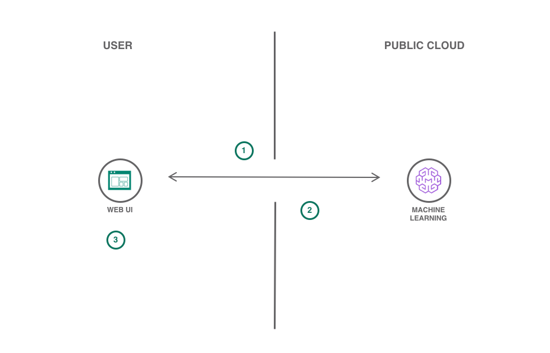
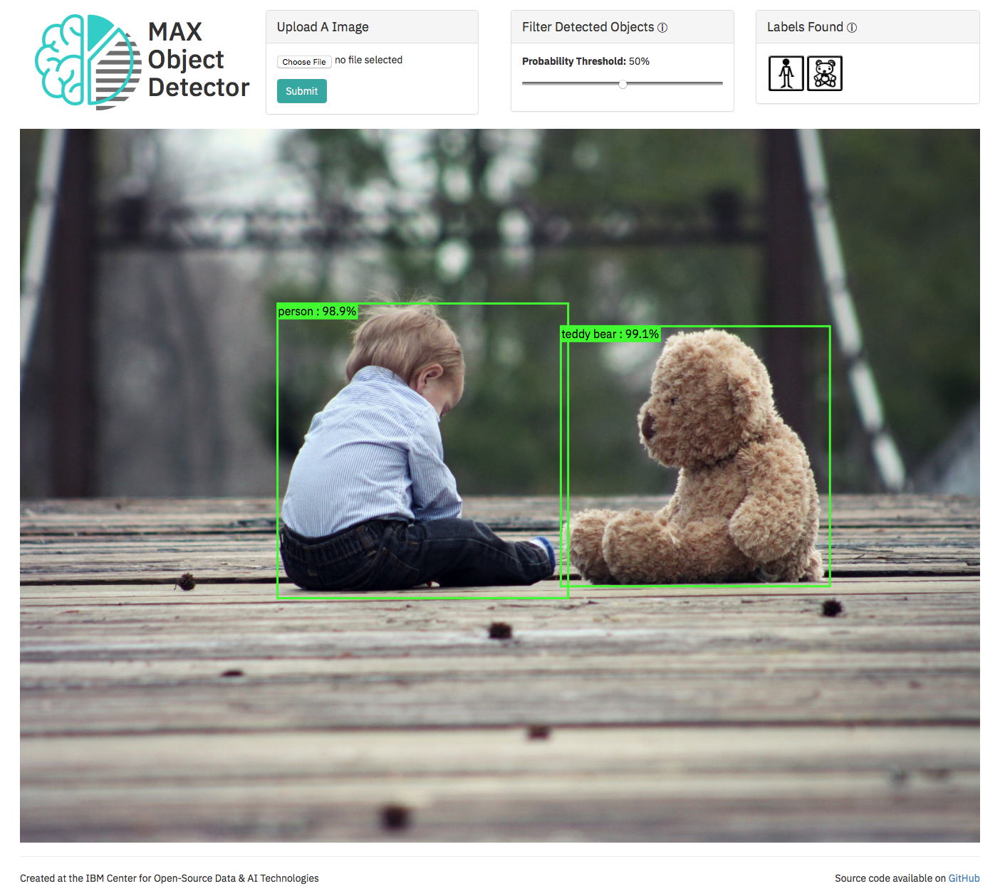

[](https://travis-ci.org/IBM/MAX-Object-Detector-Web-App) [](http://max-object-detector.max.us-south.containers.appdomain.cloud/app/)

# Create a web app to visually interact with objects detected using machine learning

In this Code Pattern we will use one of the models from the
[Model Asset eXchange (MAX)](https://developer.ibm.com/exchanges/models/),
an exchange where developers can find and experiment with open source deep learning models.
Specifically we will be using the [Object Detector](https://developer.ibm.com/exchanges/models/all/max-object-detector/)
to create a web application that will recognize objects in an image and allow the user to
filter the objects based on their detected label and prediction accuracy. The web application
provides an interactive user interface backed by a lightweight Node.js server using Express.
The server hosts a client-side web UI and relays API calls to the model from the web UI to a REST
end point for the model. The Web UI takes in an image and sends it to the model REST endpoint
via the server and displays the detected objects on the UI. The model's REST endpoint is set up
using the docker image provided on MAX. The Web UI displays the detected objects in an image
using a bounding box and label and includes a toolbar to filter the detected objects based on
their labels or a threshold for the prediction accuracy.

When the reader has completed this Code Pattern, they will understand how to:

* Build a docker image of the Object Detector MAX Model
* Deploy a deep learning model with a REST endpoint
* Recognize objects in an image using the MAX Model's REST API
* Run a web application that using the model's REST API



## Flow

1. User uses Web UI to send an image to Model API
2. Model API returns object data and Web UI displays detected objects
3. User interacts with Web UI to view and filter detected objects

## Included Components

* [IBM Model Asset Exchange](https://developer.ibm.com/exchanges/models/): A place for developers to find and use
free and open source deep learning models.

## Featured Technologies

* [Node.js](https://nodejs.org/): An open-source JavaScript run-time environment for executing server-side JavaScript code.
* [JQuery](https://jquery.com): jQuery is a cross-platform JavaScript library designed to simplify the client-side scripting of HTML.
* [Express](https://expressjs.com): A popular and minimalistic web framework for creating APIs and Web servers.

# Watch the Video

[](https://www.youtube.com/watch?v=Hs6sVWmfVFw)

# Steps

## Run Locally

#### Start the Model API

1. [Deploy the Model](#1-deploy-the-model)
2. [Experiment with the API (Optional)](#2-experiment-with-the-api-optional)

#### Start the Web App

0. [Use the embedded web app](#use-the-embedded-web-app)
1. [Get a local copy of the repository](#1-get-a-local-copy-of-the-repository)
2. [Install dependencies](#2-install-dependencies)
3. [Start the web app server](#3-start-the-web-app-server)
4. [Configure ports (Optional)](#4-configure-ports-optional)

### Start the Model API

> NOTE: The set of instructions in this section are a modified version of the ones found on the
[Object Detector Project Page](https://github.com/IBM/MAX-Object-Detector)

#### 1. Deploy the Model

To run the docker image, which automatically starts the model serving API, run:

```
$ docker run -it -p 5000:5000 codait/max-object-detector
```

This will pull a pre-built image from Docker Hub (or use an existing image if already cached locally) and run it.
If you'd rather build and run the model locally, or deploy on a Kubernetes cluster, you can follow the steps in the
[model README](https://github.com/IBM/MAX-Object-Detector/#steps).

#### 2. Experiment with the API (Optional)

The API server automatically generates an interactive Swagger documentation page.
Go to `http://localhost:5000` to load it. From there you can explore the API and also create test requests.

Use the `model/predict` endpoint to load a test image and get predicted labels for the image from the API.
The coordinates of the bounding box are returned in the `detection_box` field, and contain the array of normalized
coordinates (ranging from 0 to 1) in the form `[ymin, xmin, ymax, xmax]`.

The [model assets folder](https://github.com/IBM/MAX-Object-Detector/tree/master/assets)
contains a few images you can use to test out the API, or you can use your own.

You can also test it on the command line, for example:

```
$ curl -F "image=@assets/dog-human.jpg" -XPOST http://localhost:5000/model/predict
```

You should see a JSON response like that below:

```json
{
  "status": "ok",
  "predictions": [
      {
          "label_id": "1",
          "label": "person",
          "probability": 0.944034993648529,
          "detection_box": [
              0.1242099404335022,
              0.12507188320159912,
              0.8423267006874084,
              0.5974075794219971
          ]
      },
      {
          "label_id": "18",
          "label": "dog",
          "probability": 0.8645511865615845,
          "detection_box": [
              0.10447660088539124,
              0.17799153923988342,
              0.8422801494598389,
              0.732001781463623
          ]
      }
  ]
}
```

You can also control the probability threshold for what objects are returned using the `threshold` argument like below:

```
$ curl -F "image=@assets/dog-human.jpg" -XPOST http://localhost:5000/model/predict?threshold=0.5
```

The optional `threshold` parameter is the minimum `probability` value for predicted labels returned by the model.
The default value for `threshold` is `0.7`.

### Start the Web App

#### Use the embedded web app

The latest release of the web app is deployed with the model API above and is available at
[`http://localhost:5000/app`](http://localhost:5000/app)

To start the web app using Node.js and running the latest code, follow the steps below:

#### 1. Get a local copy of the repository

Clone the web app repository locally. In a terminal, run the following command:

```
$ git clone https://github.com/IBM/MAX-Object-Detector-Web-App
```

Change directory into the repository base folder:

```
$ cd MAX-Object-Detector-Web-App
```

#### 2. Install dependencies

Make sure Node.js and npm are installed then, in a terminal, run the following command:

```
$ npm install
```

#### 3. Start the web app server

You then start the web app by running:

```
$ node app
```

You can then access the web app at: [`http://localhost:8090`](http://localhost:8090)

#### 4. Configure ports (Optional)

If you want to use a different port or are running the model API at a different location you can change them with command-line options:

```
$ node app --port=[new port] --model=[endpoint url including protocol and port]
```

# Sample Output



# Links

* [Model Asset eXchange (MAX)](https://developer.ibm.com/exchanges/models/)
* [Center for Open-Source Data & AI Technologies (CODAIT)](https://developer.ibm.com/code/open/centers/codait/)

# Learn More

* **Artificial Intelligence Code Patterns**: Enjoyed this Code Pattern? Check out our other
[Artificial Intelligence Code Patterns](https://developer.ibm.com/technologies/artificial-intelligence/)
* **AI and Data Code Pattern Playlist**: Bookmark our
[playlist](https://www.youtube.com/playlist?list=PLzUbsvIyrNfknNewObx5N7uGZ5FKH0Fde) with all of our Code Pattern videos
* **Watson Studio**: Master the art of data science with IBM's [Watson Studio](https://dataplatform.cloud.ibm.com/)
* **Deep Learning with Watson Studio**: Design and deploy deep learning models using neural networks, easily scale to
hundreds of training runs. Learn more at [Deep Learning with Watson Studio](https://www.ibm.com/cloud/deep-learning).

# License
This code pattern is licensed under the Apache Software License, Version 2.  Separate third party code objects invoked within this code pattern are licensed by their respective providers pursuant to their own separate licenses. Contributions are subject to the [Developer Certificate of Origin, Version 1.1 (DCO)](https://developercertificate.org/) and the [Apache Software License, Version 2](https://www.apache.org/licenses/LICENSE-2.0.txt).

[Apache Software License (ASL) FAQ](https://www.apache.org/foundation/license-faq.html#WhatDoesItMEAN)
